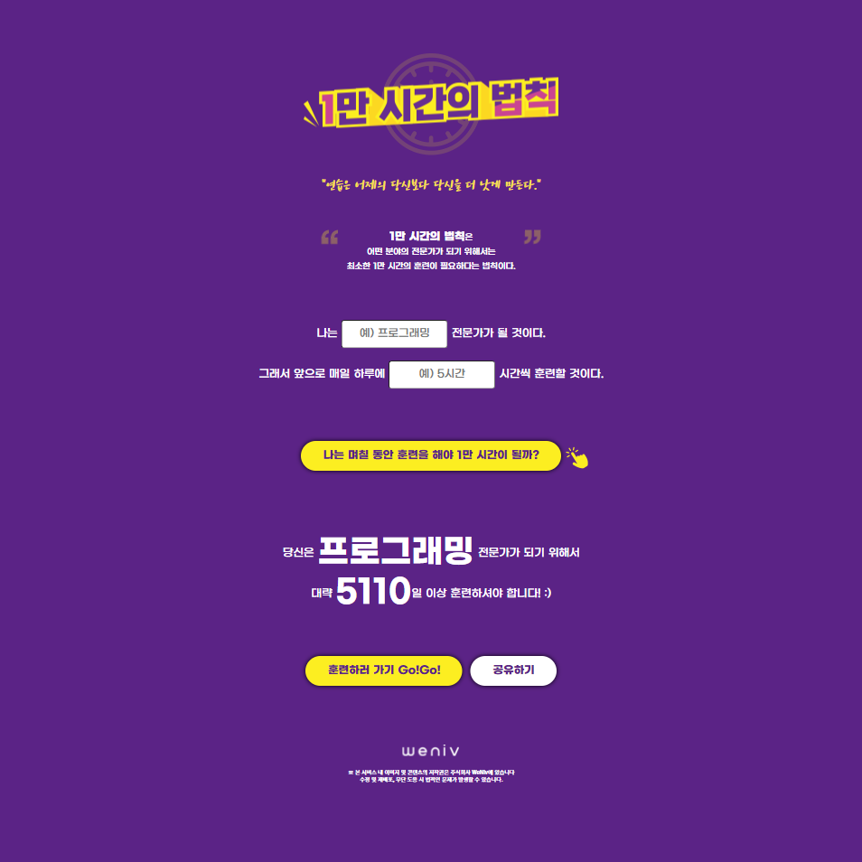

# 📝Project01 : 10K_hours_rule

#### 10만 시간의 법칙

> 어떤 분야의 전문가가 되기 위하여 최소 1만 시간이 필요하다.

## 기능

- PC/Mobile등의 스크린으로 확인 가능한 반응형 웹 구현
- 10만 시간 법칙 문구와 함께 목표달성을 위한 문구로 개인 목표에 동기 부여
- 목표를 응원하는 응원 모달창 구현
- 사이트 공유 가능한 링크 연결(UI상으로만 구현)

#### 2024.12.26 추가 완료

- 매일 몇시간을 훈련해야 원하는 목표에 달성 가능한지 계산
  - 버튼을 클릭해야 계산 내용이 화면에 렌더링 되도록 구현

## 배포 URL

https://jini0012.github.io/10K_hours_rule/

## 사용 언어

HTML, CSS

## 화면

|            📝             |                    PC                     |                    Mobile                     |
| :-----------------------: | :---------------------------------------: | :-------------------------------------------: |
|           main            |            |            |
| modalbutton 디자인동일 |  |  |
|           modal           |      |      |

## 개발하며 느낀점

- 처음 html에 css를 `<link>`로 연결할 때, `reset css`를 `10000hours.css`보다 뒤에 뒀는데문제가 뭔지 모르고 헤멨었다..결국 페이지를 다만들고 나서 알게되었지만🥲 앞으로도 `reset.css`는 무조건 css 중 첫 번쨰에 두어야한다‼️는 잊지 못할 기억을 얻은 것 같다 🥹📝
- 프로젝트 이 전에는 px 단위를 많이 쓰다가 반응형 웹으로 개발하기 위해 상대단위를 쓰는데 굉장히 낯설었다😅
- 첫 프로젝트 라서 익숙한 PC 화면 먼저 구현 후 Mobile 화면으로 구현했는데 Mobile 화면을 구현할 때 갑자기 막히는 기분이 들었다
  `@media` 미디어 쿼리에서 모바일 화면 권장 크기를 처음엔 완전 엉터리로 쓰고 있었다..권장되는 크기도 이번 프로젝트를 통해 알 수 있었고 프로젝트를 통해 여러모로 많이 배울 수 있어 좋았다.
- 아직 JS를 몰라 구현하지 못한 부분은 아쉽지만 혼자 페이지를 만들어 보는 첫 프로젝트여서 그런지 더욱 뜻 깊었고 재밌었다.👍😆
